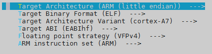
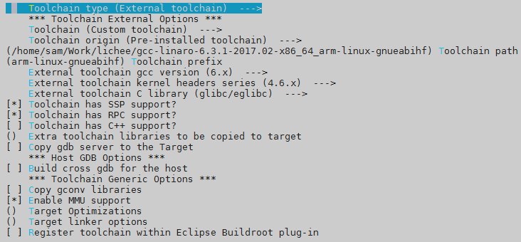
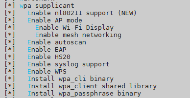
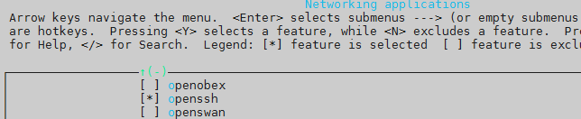

# the tour of allwinner v3s licheepi zero

before you start, you need to install the ubuntu host and many tools like toolchain properly.

some big file can not be uploaded to github, see here for them:

<https://pan.baidu.com/s/1zsOkOC2vprebuiltFyQI4IO45IcI0Q>, code: suvz

you could burn(use Win32DiskImager or something like that) this prebuilt image: kernel4.14.1_rootfs_rtl8723bs.img to have a quick start.

## 1. compile the u-boot

```
$ cd Lichee-Pi-u-boot
$ vim include/configs/sun8i.h
```

```
diff --git a/include/configs/sun8i.h b/include/configs/sun8i.h
index 6ac42acaea..c9bb34d9f7 100644
--- a/include/configs/sun8i.h
+++ b/include/configs/sun8i.h
@@ -27,6 +27,14 @@
        #define CONFIG_SUNXI_USB_PHYS   2
 #endif

+#define CONFIG_BOOTCOMMAND   "setenv bootm_boot_mode sec; " \
+    "load mmc 0:1 0x41000000 zImage; "  \
+    "load mmc 0:1 0x41800000 sun8i-v3s-licheepi-zero-dock.dtb; " \
+    "bootz 0x41000000 - 0x41800000;"
+
+#define CONFIG_BOOTARGS      "console=ttyS0,115200 panic=5 rootwait root=/dev/mmcblk0p2 earlyprintk rw  vt.global_cursor_default=0"
+
+
 /*
  * Include common sunxi configuration where most the settings are
  */
```

```
$ make ARCH=arm CROSS_COMPILE=arm-linux-gnueabihf- LicheePi_Zero_800x480LCD_defconfig
$ make ARCH=arm CROSS_COMPILE=arm-linux-gnueabihf-
# you get u-boot-sunxi-with-spl.bin now
```


## 2. compile the kernel

```
$ cd linux-4.14.1/
$ make ARCH=arm CROSS_COMPILE=arm-linux-gnueabihf- sunxi_defconfig
$ make ARCH=arm CROSS_COMPILE=arm-linux-gnueabihf-
# you get zImage now
```


## 3. compile the rootfs
```
$ cd buildroot-2018.08.2
$ make ARCH=arm CROSS_COMPILE=arm-linux-gnueabihf- menuconfig
```





```
$ rm -rf output/	# you may need to remove the directory before compiling
$ cp /other/place/dl .	# you may need the "dl" directory from other place, because the downloading of dl takes very long time
$ make ARCH=arm CROSS_COMPILE=arm-linux-gnueabihf-
# you get rootfs.tar now
```


## 4. make a booting  tfcard

before you start, you need to divide the tfcard into 2 partitions, one for kernel and devicetree, another for rootfs. the u-boot isn't in any partitions but in the 8K offset of the tfcard.

here is the layout of tfcard:

| part | filesystem | size |                    files                    |
| :--: | :--------: | :--: | :-----------------------------------------: |
|  -   |     -      |  -   | u-boot-sunxi-with-spl.bin(in the 8K offset) |
|  1   |   FAT16    | 32M  |  zImage, sun8i-v3s-licheepi-zero-dock.dtb   |
|  2   |    ext4    |  -   |            /root, /dev, /proc...            |

you could use fdisk to divide the tfcard:

```
# the tfcard in ubuntu is named: /dev/sdb
# umount the /dev/sdb* before this process
$ sudo fdisk /dev/sdb
...
input 'd' to delete all partitions in the first time
...
Command (m for help): n
Partition type
   p   primary (0 primary, 0 extended, 4 free)
   e   extended (container for logical partitions)
Select (default p):

Using default response p.
Partition number (1-4, default 1):
First sector (2048-243711, default 2048):
Last sector, +sectors or +size{K,M,G,T,P} (2048-243711, default 243711): +32M

Created a new partition 1 of type 'Linux' and of size 32 MiB.

Command (m for help): t
Selected partition 1
Partition type (type L to list all types): 6
Changed type of partition 'Linux' to 'FAT16'.

Command (m for help): n
Partition type
   p   primary (1 primary, 0 extended, 3 free)
   e   extended (container for logical partitions)
Select (default p):

Using default response p.
Partition number (2-4, default 2):
First sector (67584-243711, default 67584):
Last sector, +sectors or +size{K,M,G,T,P} (67584-243711, default 243711):

Created a new partition 2 of type 'Linux' and of size 86 MiB.

Command (m for help): w
The partition table has been altered.
Calling ioctl() to re-read partition table.
Syncing disks.
```

```
# fdisk can not make a ext4 partition, so we need to do it by mkfs.ext4
$ sudo mkfs.ext4 /dev/sdb2
Proceed anyway? (y,n) y
```

copy some files into the tfcard:

```
# mount the /dev/sdb* before this process
# the #1 partition is mounted at /mnt/sdb1
# the #2 partition is mounted at /mnt/sdb2
$ sudo cp linux-4.14.1/arch/arm/boot/zImage /mnt/sdb1
$ sudo cp linux-4.14.1/arch/arm/boot/dts/sun8i-v3s-licheepi-zero-dock.dtb /mnt/sdb1
$ sudo tar -xf buildroot-2018.08.2/output/images/rootfs.tar -C /mnt/sdb2
$ sync
```

write the u-boot in:

```
# umount the /dev/sdb* before this process
$ sudo dd if=Lichee-Pi-u-boot/u-boot-sunxi-with-spl.bin of=/dev/sdb bs=1024 seek=8
```


## 5. start licheepi zero

insert the tfcard, plug the usb2uart(with 3v3 power) cable to the uart0 pin, open minicom in ubuntu.


## 6. issues

------

**the power**

the power of usb2uart cable sometimes may not be functional, so you may need to use the usb otg to power licheepi zero.

------

**the tfcard**

sometimes licheepi zero won't boot properly cause the image in tfcard isn't good, so it is recommended to operate the tfcard more times as the former context said.

------

**how to use the rtl8723bs(wifi)**

the kernel should enable the rtl8723bs:

```
$ cd linux-4.14.1/
$ vim arch/arm/configs/sunxi_defconfig
-# CONFIG_WLAN is not set
+CONFIG_STAGING=y
+CONFIG_WLAN=y
+CONFIG_CFG80211=y
+CONFIG_RTL8723BS=m

$ make ARCH=arm CROSS_COMPILE=arm-linux-gnueabihf- sunxi_defconfig
$ make ARCH=arm CROSS_COMPILE=arm-linux-gnueabihf-
```

the buildroot should enable the wpa_supplicant. openssh is optional:

```
$ cd buildroot-2018.08.2
$ make ARCH=arm CROSS_COMPILE=arm-linux-gnueabihf- menuconfig
```






```
$ make ARCH=arm CROSS_COMPILE=arm-linux-gnueabihf-
```

now copy the new kernel, devicetree and rootfs to tfcard:

```
$ sudo cp linux-4.14.1/arch/arm/boot/zImage /mnt/sdb1
$ sudo cp linux-4.14.1/arch/arm/boot/dts/sun8i-v3s-licheepi-zero-dock.dtb /mnt/sdb1
$ cp linux-4.14.1/drivers/staging/rtl8723bs/r8723bs.ko patch/
$ sudo rm -rf /mnt/sdb2/*
$ sudo tar -xf buildroot-2018.08.2/output/images/rootfs.tar -C /mnt/sdb2
$ cd patch/
$ sudo ./fill_the_rootfs.sh /mnt/sdb2
$ sudo ./config_ssh.sh /mnt/sdb2
$ sync
```

at this moment, you should provide a wifi ap name:"OPPO K1", password:"12345678". then insert the tfcard, install the power, start a ssh in ubuntu to licheepi zero.
note that once you compiled the kernel the file r8723bs.ko should be recopy to rootfs, otherwise, the r8723bs.ko will be failed when insmod.

------

**reference website**

- https://www.kancloud.cn/lichee/lpi0/327885
- https://blog.csdn.net/Jun626/article/details/90082000
- https://whycan.cn/t_561.html
- https://www.kancloud.cn/lichee/lpi0/340992
- http://zero.lichee.pro/
- https://blog.csdn.net/Code_MoMo/article/details/104623584/
- https://whycan.cn/t_2169.html
- https://www.cnblogs.com/ZQQH/p/8366992.html
- http://www.yz0228.com/index.php/2019/11/08/lichee_zero_spi_start/
- https://www.cnblogs.com/ZQQH/p/8360105.html
- https://cn.dl.sipeed.com/
- https://blog.csdn.net/juhou/article/details/98075294
- https://www.cnblogs.com/chenfulin5/p/7550812.html
