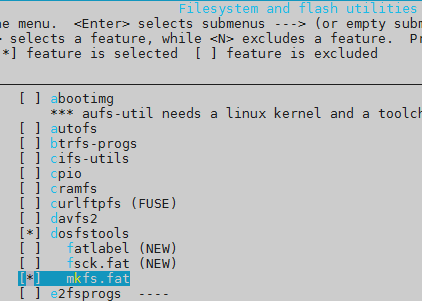

# The tour of allwinner v3s licheepi zero


​                                                                            (figure 1)


​                                                                             (table 1)


to have a quick start, you could do the procedure bellow to burn a ready-to-run tfcard:

```
# insert your tfcard into your computer
$ cd bin
$ ./pack
```

after the tfcard is burning done, insert it to the board and power up, you could login the buildroot system with root without password.


## 1    compile the u-boot

```
$ cd u-boot
$ vim include/configs/sun8i.h
```

```
diff --git a/include/configs/sun8i.h b/include/configs/sun8i.h
index 6ac42acaea..c9bb34d9f7 100644
--- a/include/configs/sun8i.h
+++ b/include/configs/sun8i.h
@@ -27,6 +27,14 @@
        #define CONFIG_SUNXI_USB_PHYS   2
 #endif

+#define CONFIG_BOOTCOMMAND   "setenv bootm_boot_mode sec; " \
+    "load mmc 0:1 0x41000000 zImage; "  \
+    "load mmc 0:1 0x41800000 sun8i-v3s-licheepi-zero-dock.dtb; " \
+    "bootz 0x41000000 - 0x41800000;"
+
+#define CONFIG_BOOTARGS      "console=ttyS0,115200 panic=5 rootwait root=/dev/mmcblk0p2 earlyprintk rw  vt.global_cursor_default=0"
+
+
 /*
  * Include common sunxi configuration where most the settings are
  */
```

```
$ make ARCH=arm CROSS_COMPILE=arm-linux-gnueabihf- LicheePi_Zero_800x480LCD_defconfig
$ make ARCH=arm CROSS_COMPILE=arm-linux-gnueabihf-
# you get u-boot-sunxi-with-spl.bin now
```

## 2    compile the kernel

```
$ cd linux-4.14.1/
$ make ARCH=arm CROSS_COMPILE=arm-linux-gnueabihf- sunxi_defconfig
$ make ARCH=arm CROSS_COMPILE=arm-linux-gnueabihf-
# you get zImage now
```

## 3    compile the rootfs
```
$ cd buildroot-2018.08.2
$ make ARCH=arm CROSS_COMPILE=arm-linux-gnueabihf- menuconfig
```


```
$ rm -rf output/	# you may need to remove the directory before compiling
$ cp /other/place/dl .	# you may need the "dl" directory from other place, because the downloading of dl takes very long time
$ make ARCH=arm CROSS_COMPILE=arm-linux-gnueabihf-
# you get rootfs.tar now
```

## 4    make a booting  tfcard

before you start, you need to divide the tfcard into 2 partitions, one for kernel and devicetree, another for rootfs. the u-boot isn't in any partitions but in the 8K offset of the tfcard.

here is the layout of tfcard:

| part | filesystem | size |                    files                    |
| :--: | :--------: | :--: | :-----------------------------------------: |
|  -   |     -      |  -   | u-boot-sunxi-with-spl.bin(in the 8K offset) |
|  1   |   FAT16    | 32M  |  zImage, sun8i-v3s-licheepi-zero-dock.dtb   |
|  2   |    ext4    |  -   |            /root, /dev, /proc...            |

you could use fdisk to divide the tfcard:

```
# the tfcard in ubuntu is named: /dev/sdb
# umount the /dev/sdb* before this process
$ sudo fdisk /dev/sdb
...
input 'd' to delete all partitions in the first time
...
Command (m for help): n
Partition type
   p   primary (0 primary, 0 extended, 4 free)
   e   extended (container for logical partitions)
Select (default p):

Using default response p.
Partition number (1-4, default 1):
First sector (2048-243711, default 2048):
Last sector, +sectors or +size{K,M,G,T,P} (2048-243711, default 243711): +32M

Created a new partition 1 of type 'Linux' and of size 32 MiB.

Command (m for help): t
Selected partition 1
Partition type (type L to list all types): 6
Changed type of partition 'Linux' to 'FAT16'.

Command (m for help): n
Partition type
   p   primary (1 primary, 0 extended, 3 free)
   e   extended (container for logical partitions)
Select (default p):

Using default response p.
Partition number (2-4, default 2):
First sector (67584-243711, default 67584):
Last sector, +sectors or +size{K,M,G,T,P} (67584-243711, default 243711):

Created a new partition 2 of type 'Linux' and of size 86 MiB.

Command (m for help): w
The partition table has been altered.
Calling ioctl() to re-read partition table.
Syncing disks.
```

```
# fdisk can not make a ext4 partition, so we need to do it by mkfs.ext4
$ sudo mkfs.ext4 /dev/sdb2
Proceed anyway? (y,n) y
```

copy some files into the tfcard:

```
# mount the /dev/sdb* before this process
# the #1 partition is mounted at /mnt/sdb1
# the #2 partition is mounted at /mnt/sdb2
$ sudo cp linux-4.14.1/arch/arm/boot/zImage /mnt/sdb1
$ sudo cp linux-4.14.1/arch/arm/boot/dts/sun8i-v3s-licheepi-zero-dock.dtb /mnt/sdb1
$ sudo tar -xf buildroot-2018.08.2/output/images/rootfs.tar -C /mnt/sdb2
$ sync
```

write the u-boot in:

```
# umount the /dev/sdb* before this process
$ sudo dd if=u-boot/u-boot-sunxi-with-spl.bin of=/dev/sdb bs=1024 seek=8
```

## 5    start licheepi zero

insert the tfcard, plug the usb2uart(with 3v3 power) cable to the uart0 pin, open minicom in ubuntu.

## 6    issues

------

**the power**

the power of usb2uart cable sometimes may not be functional, so you may need to use the usb otg to power licheepi zero.

------

**the tfcard**

sometimes licheepi zero won't boot properly cause the image in tfcard isn't good, so it is recommended to operate the tfcard more times as the former context said.

------

**how to use the rtl8723bs(wifi)**

the kernel should enable the rtl8723bs:

```
$ cd linux-4.14.1/
$ vim arch/arm/configs/sunxi_defconfig
-# CONFIG_WLAN is not set
+CONFIG_STAGING=y
+CONFIG_WLAN=y
+CONFIG_CFG80211=y
+CONFIG_RTL8723BS=m

$ make ARCH=arm CROSS_COMPILE=arm-linux-gnueabihf- sunxi_defconfig
$ make ARCH=arm CROSS_COMPILE=arm-linux-gnueabihf-
```

the buildroot should enable the wpa_supplicant. openssh is optional:

```
$ cd buildroot-2018.08.2
$ make ARCH=arm CROSS_COMPILE=arm-linux-gnueabihf- menuconfig
```


```
$ make ARCH=arm CROSS_COMPILE=arm-linux-gnueabihf-
```

now copy the new kernel, devicetree and rootfs to tfcard:

```
$ sudo cp linux-4.14.1/arch/arm/boot/zImage /mnt/sdb1
$ sudo cp linux-4.14.1/arch/arm/boot/dts/sun8i-v3s-licheepi-zero-dock.dtb /mnt/sdb1
$ sudo cp linux-4.14.1/drivers/staging/rtl8723bs/r8723bs.ko v3s_licheepi_sdk/patch/
$ sudo rm -rf /mnt/sdb2/*
$ sudo tar -xf buildroot-2018.08.2/output/images/rootfs.tar -C /mnt/sdb2
$ cd v3s_licheepi_sdk/patch/
$ sudo ./fill_the_rootfs.sh
Please enter your rootfs path:
/mnt/sdb2
Please enter your WIFI AP name:
mywifi
Please enter your WIFI AP password:
12345678
$ sudo ./config_ssh.sh /mnt/sdb2
$ sync
```

at this moment, you should provide a wifi ap which has the name and password you specified to "fill_the_rootfs.sh". then insert the tfcard, install the power, start a ssh to licheepi zero.

note that once you compile the kernel, the r8723bs.ko could be failed to insmod, so you may need to recopied it to rootfs.

------

**how to debug a spi device with /dev/spidevX.Y**

X means spi controller number, Y means spi controller CS pin number.

it is useful that debugging a spi device using SHELL script.


add these to your sun8i-v3s-licheepi-zero-dock.dts:

```
+&spi0 {
+    status = "okay";
+
+    spidev@0 {
+        compatible = "rohm,dh2228fv";
+        reg = <0>;
+        spi-max-frequency = <1000000>;
+    };
+};
```

*note: the "rohm,dh2228fv" looks doesn't associated to spidev, but it truly work.*

enabling these config in your kernel:

```
+CONFIG_SPI_SPIDEV=y
```

enbling these config in your buildroot:

```
+BR2_PACKAGE_SPI_TOOLS=y
```

now you can debug your spi device with SHELL script:

you need to connect you MISO and MOSI directly before the test.

config your spidev:

```
# spi-config -m 3 -l 0 -b 8 -s 1000000 -d /dev/spidev0.0
```

check out your spidev config:

```
# spi-config -d /dev/spidev0.0 -q
/dev/spidev0.0: mode=3, lsb=0, bits=8, speed=1000000
```

sending and receiving test:

```
# spi-pipe -d /dev/spidev0.0 -b 8 -n 1
12345678
12345678#
```
you type "12345678" and the spidev reply "12345678".

------

**how to add w25q64(spi nor flash) to licheepi**

first you need to connect a w25q64 module to licheepi's spi port. then you modify the devicetree file(arch/arm/boot/dts/sun8i-v3s-licheepi-zero-dock.dts):

```
+&spi0 {
+    status = "okay";
+
+    w25q64@0 {
+        compatible = "jedec,spi-nor";
+        spi-max-frequency = <12000000>;
+        reg = <0>;
+    };
+};
```

and the defconfig file(arch/arm/configs/sunxi_defconfig b/arch/arm/configs/sunxi_defconfig)(for convenience, I also add the wifi support, rtl8723bs):

```
-# CONFIG_WLAN is not set
+CONFIG_STAGING=y
+CONFIG_WLAN=y
+CONFIG_CFG80211=y
+CONFIG_RTL8723BS=m
+
+CONFIG_SPI_MASTER=y
+CONFIG_MTD=y
+CONFIG_MTD_SPI_NOR=y
+CONFIG_MTD_M25P80=y
+CONFIG_MTD_BLOCK=y
```

the buildroot should also be configured:



now, reboot licheepi, enter these commands:

```
# mkfs.fat /dev/mtdblock0
# mkdir /mnt/w25q64/
# mount -t vfat /dev/mtdblock0 /mnt/w25q64/
```

done.

------

**how to add w5500 to licheepi**

w5500 is a spi ethernet 10M/100M phy chip.

config your kernel:


add w5500 node to your sun8i-v3s-licheepi-zero-dock.dts:

```
+&spi0 {
+	status = "okay";
+
+	w5500@0 {
+		compatible = "w5500";
+		reg = <0>;
+		spi-max-frequency = <12000000>;
+		interrupt-parent = <&pio>;
+		interrupts = <1 0 IRQ_TYPE_EDGE_FALLING>;   /* PB00 */
+	};
+};
```

connect the w5500 module to licheepi:

| w5500 | licheepi |
| ----- | -------- |
| MISO  | MISO     |
| MOSI  | MOSI     |
| CS    | CS       |
| SCK   | SCK      |
| RST   | PB00     |

note:
- it's MISO and MOSI connects to your SOC's MISO and MOSI.

- the RST pin could also be others that supports external-irq whose names are PB_EINT[0-9] and PG_EINT[0-5], as the following table shows. but remember the pin must not be occupied by other driver.

  

now you can start licheepi and it should work.

------

**how to debug an i2c device with /dev/i2c-X**

it is useful that debugging an i2c device using SHELL script.

make sure this config is enabled in your kernel(the original kernel config, sunxi_defconfig already has it):

```
CONFIG_I2C_CHARDEV=y
```

and the i2c0 node must be enabled in your sun8i-v3s-licheepi-zero-dock.dts:

```
+&i2c0 {
+    status = "okay";
+};
```

and this config must be enabled in your buildroot:

```
BR2_PACKAGE_I2C_TOOLS=y
```

now let's do an example base on at24c02:

scan i2c driver:

```
# i2cdetect -l
i2c-0   i2c             mv64xxx_i2c adapter                     I2C adapter
```

get the functionalities supported by i2c-0:

```
# i2cdetect -F 0
Functionalities implemented by /dev/i2c-0:
I2C                              yes
SMBus Quick Command              yes
SMBus Send Byte                  yes
SMBus Receive Byte               yes
SMBus Write Byte                 yes
SMBus Read Byte                  yes
SMBus Write Word                 yes
SMBus Read Word                  yes
SMBus Process Call               yes
SMBus Block Write                yes
SMBus Block Read                 no
SMBus Block Process Call         no
SMBus PEC                        yes
I2C Block Write                  yes
I2C Block Read                   yes
```

scan i2c device:

```
# i2cdetect -y 0
     0  1  2  3  4  5  6  7  8  9  a  b  c  d  e  f
00:          -- -- -- -- -- -- -- -- -- -- -- -- --
10: -- -- -- -- -- -- -- -- -- -- -- -- -- -- -- --
20: -- -- -- -- -- -- -- -- -- -- -- -- -- -- -- --
30: -- -- -- -- -- -- -- -- -- -- -- -- -- -- -- --
40: -- -- -- -- -- -- -- -- 48 -- -- -- -- -- -- --
50: 50 -- -- -- -- -- -- -- -- -- -- -- -- -- -- --
60: -- -- -- -- -- -- -- -- -- -- -- -- -- -- -- --
70: -- -- -- -- -- -- -- --
```

the 0x50 in that table means an i2c device whose address(7bit) is 0x50 is found, and that's our at24c02.

*note: the address 0x48, came from where? I don't know, it always stay there even the i2c port doesn't connect any thing.*

check out the memory of at24c02:

```
# i2cdump -y 0 0x50
No size specified (using byte-data access)
     0  1  2  3  4  5  6  7  8  9  a  b  c  d  e  f    0123456789abcdef
00: 2b 2b 2b 2b 0a 65 70 0a 00 00 00 00 00 00 00 00    ++++?ep?........
10: 00 00 00 00 00 00 00 00 00 00 00 00 00 00 00 00    ................
20: 00 00 00 00 00 00 00 f9 00 00 00 00 00 00 00 00    .......?........
30: 78 33 43 43 38 46 46 00 00 00 00 00 f9 00 00 00    x3CC8FF.....?...
40: 00 00 00 00 00 00 00 00 00 00 00 00 00 00 00 00    ................
50: 00 00 00 00 00 00 00 00 00 00 00 00 00 00 00 00    ................
60: 00 00 00 00 00 00 00 00 00 00 00 00 00 00 00 00    ................
70: 00 00 00 00 00 00 00 00 33 33 78 34 34 33 00 00    ........33x443..
80: 00 00 00 00 00 00 00 00 00 00 00 00 00 00 00 00    ................
90: 00 00 00 00 00 00 00 00 00 00 00 00 00 00 00 00    ................
a0: 00 00 00 00 00 00 00 00 00 00 00 00 00 00 00 00    ................
b0: 00 00 00 00 00 00 00 00 00 00 00 00 00 00 00 00    ................
c0: 00 00 00 00 00 00 00 00 00 00 00 00 00 00 00 00    ................
d0: 00 00 00 00 00 00 00 00 00 00 00 00 00 00 00 00    ................
e0: 00 00 00 00 00 00 00 00 00 00 00 00 00 00 00 00    ................
f0: 00 00 00 00 00 00 00 00 00 00 00 00 00 00 00 00    ................
```

read a byte from address 0x78:

```
# i2cget -y 0 0x50 0x78
0x33
```

write a byte 0xa5 to address 0xf0:

```
# i2cset -y 0 0x50 0xf0 0xa5
```

read 8 bytes from address 0x77:

```
# i2ctransfer -y 0 w1@0x50 0x77 r8
```

- "w1@0x50":
				- w:	doing an i2c write command. in other words, the i2c head frame's rw bit is w(note that you must write the address 0x77 before reading data, so the 'w' there, not 'r');
	- 1:	1 byte data will be written. this byte is after the i2c head frame;
	- @0x50:	the i2c device address;

- 0x77: 			the address to be read. note that this byte locates in the i2c head frame;
- r8:				read 8 bytes. the 'r' command will trigger another i2c package to read all the data;

write 8 bytes to address 0xe0:

```
# i2ctransfer -y 0 w9@0x50 0xe0 0xaa 0xbb 0xcc 0xdd 0x11 0x22 0x33 0x44
```


by the way, the program, i2c-tools can also be installed in ubuntu:

```
# apt-get install i2c-tools
```

so you can use `man i2c-tools` to get more details about it.

here is it's options meaning:

```
OPTIONS
       -y     Disable interactive mode. By default, i2cdetect will wait for a confirmation from the user before messing with the I2C bus. When  this
              flag is used, it will perform the operation directly. This is mainly meant to be used in scripts.

       -a     Force scanning of non-regular addresses. Not recommended.

       -q     Use  SMBus  "quick  write"  commands for probing (by default, the command used is the one believed to be the safest for each address).
              Not recommended. This is known to corrupt the Atmel AT24RF08 EEPROM found on many IBM Thinkpad laptops.

       -r     Use SMBus "read byte" commands for probing (by default, the command used is the one believed to be the safest for each address).   Not
              recommended. This is known to lock SMBus on various write-only chips (most notably clock chips at address 0x69).

       -F     Display the list of functionalities implemented by the adapter and exit.

       -V     Display the version and exit.

       -l     Output a list of installed busses.
```

---

**how to add at24c02(eeprom) to licheepi**

first you need to connect the at24c02 module to licheepi's i2c0 port. then modify devicetree(arch/arm/boot/dts/sun8i-v3s-licheepi-zero-dock.dts):

```
+&i2c0 {
+    status = "okay";
+
+    at24c02@50 {
+        compatible = "24c02";
+        reg = <0x50>;		// the at24c02's A0,A1,A2 is all zero, your board may be different
+        pagesize = <8>;
+    };
+};
```

modify the defconfig(arch/arm/configs/sunxi_defconfig):

```
+CONFIG_EEPROM_AT24=y
+CONFIG_SYSFS=y
+CONFIG_I2C=y
```

now, recompile the kernel and reboot it, type that commands to check it out:

```
# cd /sys/bus/i2c/devices/0-0050/driver
# echo hello > eeprom
# xxd -c 8 -g 1 eeprom
```

---

**How to debug kernel with KGDB**

make ARCH=arm CROSS_COMPILE=arm-linux-gnueabihf- menuconfig

```
CONFIG_KGDB
CONFIG_KGDB_SERIAL_CONSOLE
CONFIG_KGDB_KDB
CONFIG_DEBUG_KERNEL
CONFIG_DEBUG_INFO
CONFIG_DEBUG_RODATA=n
```

put this into your uboot:

```
setenv bootargs 'console=ttyS0,115200 panic=5 rootwait root=/dev/mmcblk0p2 earlyprintk rw  vt.global_cursor_default=0  kgdboc=ttyS0,9600 kgdbwait'
```

when licheepi startsup, connect it's console uart to your Ubuntu host, then put these into your terminal:

```
arm-linux-gnueabihf-gdb vmlinux
(gbd) target remote /dev/ttyUSB0
```

it is not convenient to use KGDB over a serial, very slow. and KGDB over ethernet may be faster but it is not supported by the original kernel, so you may need to patch the kernel if you wanna use it.

------

**reference website**

- https://www.kancloud.cn/lichee/lpi0/327885
- https://blog.csdn.net/Jun626/article/details/90082000
- https://whycan.cn/t_561.html
- https://www.kancloud.cn/lichee/lpi0/340992
- http://zero.lichee.pro/
- https://blog.csdn.net/Code_MoMo/article/details/104623584/
- https://whycan.cn/t_2169.html
- https://www.cnblogs.com/ZQQH/p/8366992.html
- http://www.yz0228.com/index.php/2019/11/08/lichee_zero_spi_start/
- https://www.cnblogs.com/ZQQH/p/8360105.html
- https://cn.dl.sipeed.com/
- https://blog.csdn.net/juhou/article/details/98075294
- https://www.cnblogs.com/chenfulin5/p/7550812.html
